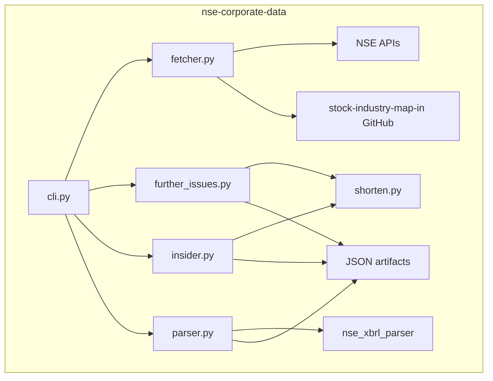

# Architecture

`cli.py` exposes grouped workflows: `further-issues fetch`, `further-issues shorten`, `insider-trading fetch`, and `insider-trading shorten`. Both fetch commands use canonical machine-facing repeatable options rather than upstream NSE labels: `--category pref|qip` for further issues and `--mode ...` tokens for insider trading, with internal expansion back to the raw NSE values. `fetcher.py` owns NSE session setup, JSON endpoint fetches, XBRL downloads, detailed scrip-data lookups, and cached industry-map retrieval; detailed market-data responses are cached per symbol to avoid repeated NSE hits within a run, and `getDetailedScripData` retries the valid series set (`EQ`, `BE`, `BZ`, `SM`, `ST`, `SZ`) when NSE returns an empty shell response for the default series. `parser.py` normalizes heterogeneous NSE payloads through configurable symbol/XBRL field mapping, enriches each row with industry and a compact market-data block, and can skip insider-trading XBRL parsing entirely when configuration disables it. `shorten.py` provides the shared metadata-driven local shortening helper, while `further_issues.py` and `insider.py` each define workflow-specific declarative field registries and builder functions. The preferential short artifact preserves `revisedFlag` so consumers can detect revised or duplicate filings.
