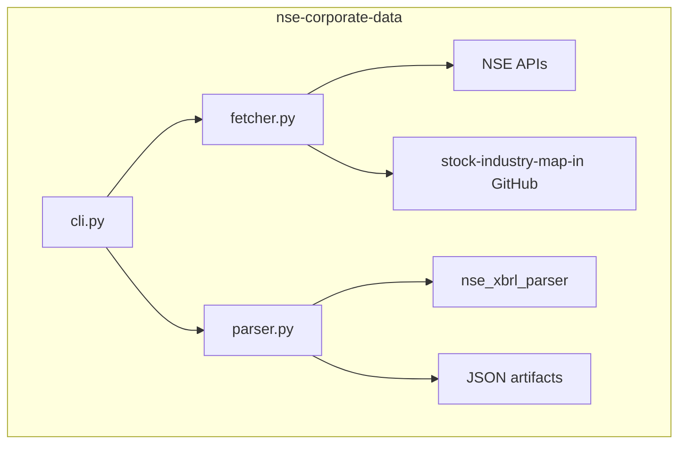

# Architecture

`cli.py` exposes separate `further-issues` and `insider-trading` commands that share the same silent execution model and JSON result contract. `fetcher.py` owns NSE session setup, JSON endpoint fetches, XBRL downloads, quote lookups, and cached industry-map retrieval. `parser.py` normalizes heterogeneous NSE payloads through configurable symbol/XBRL field mapping, enriches each row with industry and CMP data, and tolerates insider-trading XBRL parser failures while preserving the rest of the dataset.
